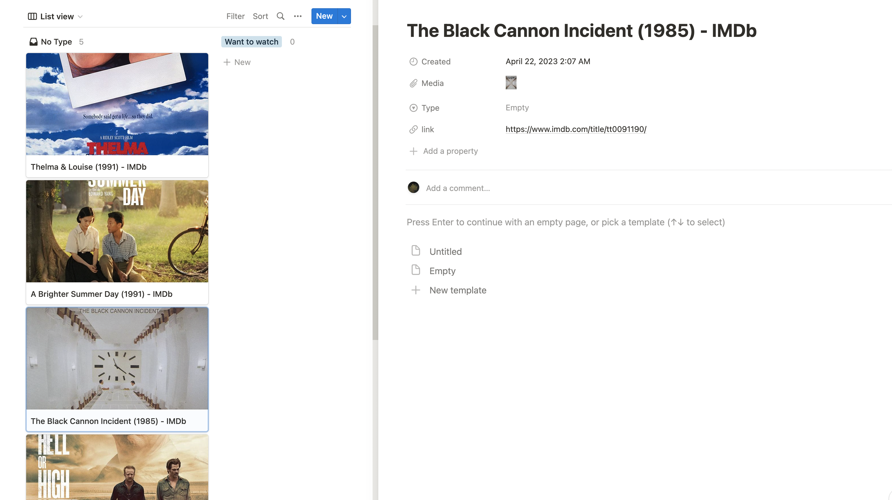

# Movie Notion Automation

This is a command-line tool to automate adding movies to Notion using IMDb URLs.

## Installation

1. Clone the repository
   ```
   git clone https://github.com/your_username/movie-notion-automation.git
   ```
2. Navigate to the project directory
   ```
   cd movie-notion-automation
   ```
3. Install the required packages
   ```
   pip3 install -r requirements.txt
   ```
4. Run the script with your desired movie name as an argument
   ```
   python3 automation.py --movie="MOVIE_NAME"
   ```

## Sample Usage

```
python3 automation.py --movie="黑炮事件"
https://www.imdb.com/title/tt0091190/
```
```
python3 automation.py --movie="牯岭街少年杀人事件"
https://www.imdb.com/title/tt0101985/
```
```
python3 automation.py --movie="thelma&louise"
https://www.imdb.com/title/tt0103074/
```

Adds the corresponding pages with image to your notion database:



Note: You need to have a Notion API key and database ID to use this tool. Add your secret key and database ID to `secrets_notion.py` like below.

```
notion_secret_key = "secret_xxxxxxxxxxx"
db_id = "xxxxxxxxxxxxxxxxxxxxxxxxxxxxxxxx"
```